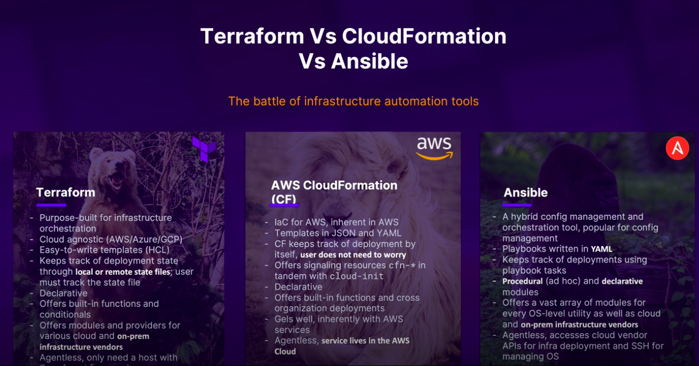

# Infrastructure As Code with Terraform and Ansible
## Terraform

### What is Terraform?
Terraform is a tool for building, changing, and versioning infrastructure safely and efficiently. Terraform can manage existing and popular service providers as well as custom in-house solutions.

## CloudFormation
### What is AWS CloudFormation?
AWS CloudFormation is a service that gives developers and businesses an easy way to create a collection of related AWS and third-party resources, and provision and manage them in an orderly and predictable fashion.

## Ansible
### What is Ansible?
Ansible is a radically simple IT automation engine that automates cloud provisioning, configuration management, application deployment, intra-service orchestration, and many other IT needs.

## Comparative chart

## Install Terraform

[Script to install Terraform](https://github.com/castillo9x/installation-scripts/blob/main/linux/terraform/install-terraform.sh)

## Install Ansible

[Script to install Ansible](https://github.com/castillo9x/installation-scripts/blob/main/linux/ansible/install-ansible.sh)

## Install AWS-Cli

[Script to install aws-cli](https://github.com/castillo9x/installation-scripts/blob/main/linux/aws-cli/install-aws-cli.sh)

## AWS configure
`aws configure`
* Enter AWS Access Key
* Enter Secret Access Key
* Enter Region
* Enter Format

## Terraform's life cycle

The steps shown in the diagram follow this sequence:

1. Code development
2. Code formatting with *terraform fmt*
    * Formats templates for readability
    * Helps in keeping code consistent
3. Initialization with *terraform init*
    * Initializes working directory
    * Needs to be run before deploying infraestructure
    * Syncs config, safe to run
4. Code validation with *terraform validate*
    * VCalidates config files
    * Needs *terraform init* to be run first
5. Planning with *terraform plan*
    * Create execution plan
    * Fail-safe before actual deployment
    * Execution plan can be saved using the -out flag
6. Deploy with *terraform apply*
    * Deploy the execution plan
7. Manual verification of Terraform changes on infrastructure

