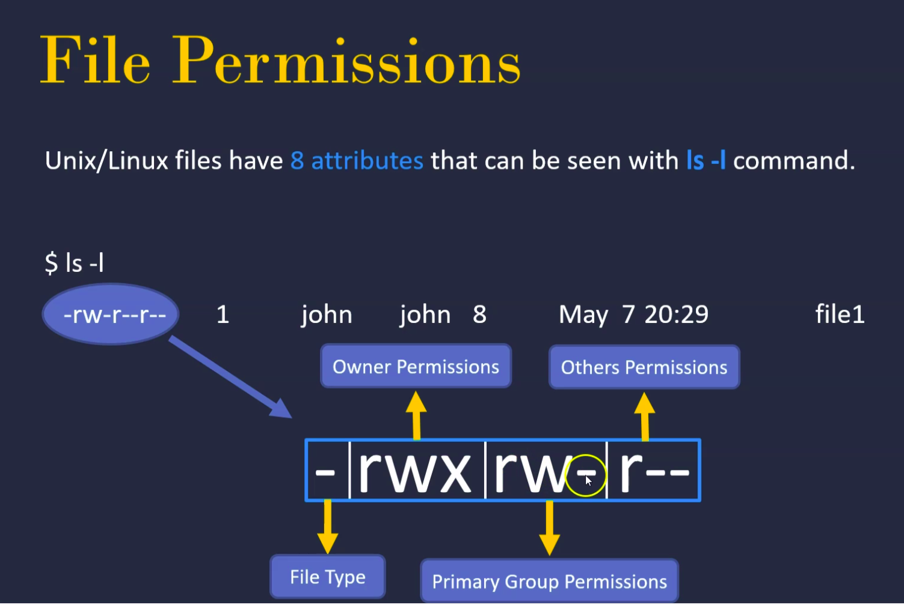
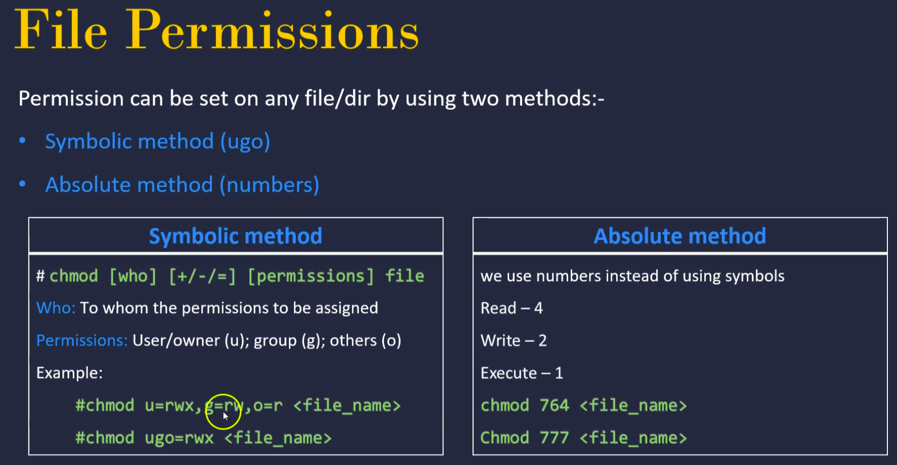
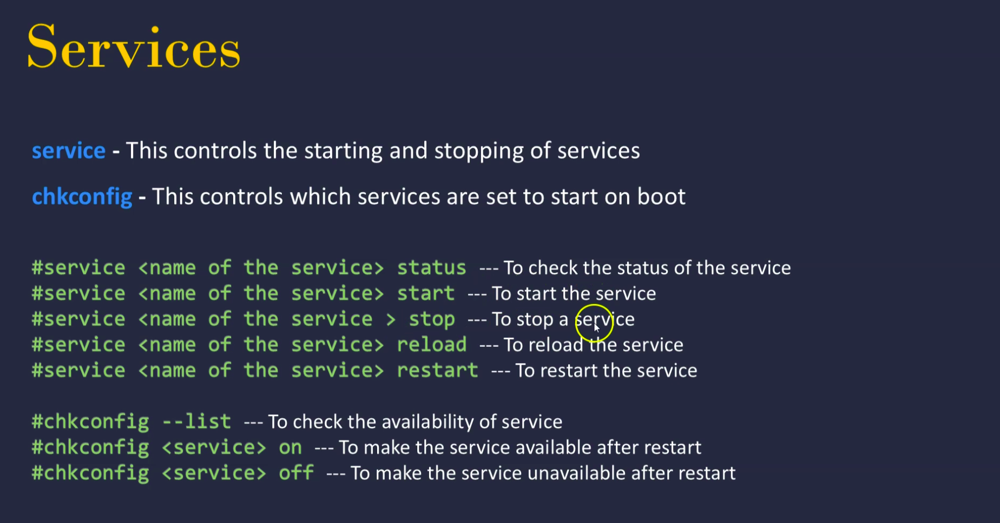
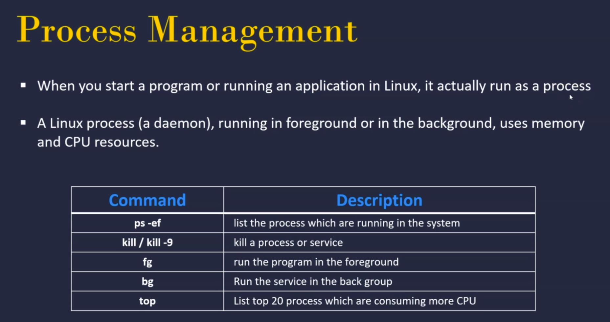
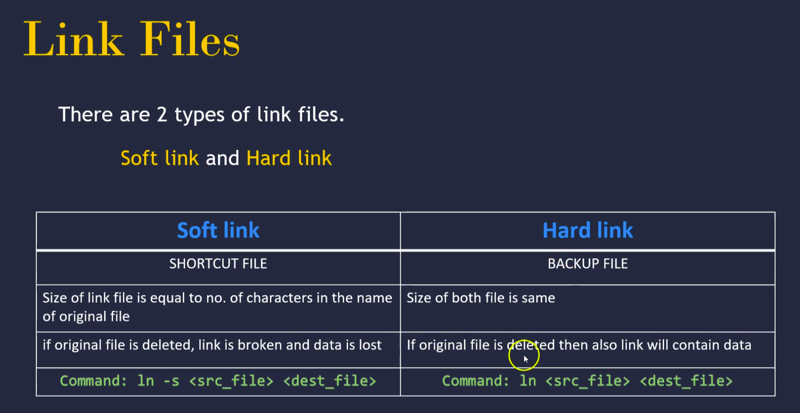

# Linux for Cloud & DevOps Engineers

Linux is based on UNIX and hence it borrows its filesystem hierarchy from UNIX.

## How to SSH using Linux

### AWS: EC2 Instance connect
`ssh -i "FileName.pem" ec2-user@ec2-IP.compute-1.amazonaws.com`

In case of error

`@@@@@@@@@@@@@@@@@@@@@@@@@@@@@@@@@@@@@@@@@@@@@@@@@@@@@@@@@@@

@         WARNING: UNPROTECTED PRIVATE KEY FILE!          @

@@@@@@@@@@@@@@@@@@@@@@@@@@@@@@@@@@@@@@@@@@@@@@@@@@@@@@@@@@@`

run chmod 0400 command

`chmod 0400 FileName.pem`

## Bash Commands
| Syntax | Description |
| ----------- | ----------- |
| uname -a | Show system and kernel |
| head -n1 /etc/issue | Show distri­bution |
| mount | Show mounted filesy­stems |
| date | Show system date |
| uptime | Show uptime |
| whoami | Show your username |

## Bash Variables
| Syntax | Description |
| ----------- | ----------- |
| env |Show enviro­nment variables |
| echo $NAME | Output value of $NAME variable |
| export NAME=value | Set $NAME to value |
| $PATH | Executable search path |
| $HOME | Home directory |
| $SHELL | Current shell |

## IO Redire­ction
| Syntax | Description |
| ----------- | ----------- |
| cmd < file | Input of cmd from file|
| cmd1 <(cmd2) | Output of cmd2 as file input to cmd1 |
| cmd > file | Standard output (stdout) of cmd to file |
| cmd > /dev/null |Discard stdout of cmd |
| cmd >> file | Append stdout to file |
| cmd 2> file | Error output (stderr) of cmd to file |
| cmd 1>&2 | stdout to same place as stderr |
| cmd 2>&1 | stderr to same place as stdout |
| cmd &> file | Every output of cmd to file |

## Pipes
| Syntax | Description |
| ----------- | ----------- |
| cmd1 \| cmd2| stdout of cmd1 to cmd2  |
| cmd1 \|& cmd2| stderr of cmd1 to cmd2|

## Command Lists
| Syntax | Description |
| ----------- | ----------- |
| cmd1 ; cmd2 | Run cmd1 then cmd2|
| cmd1 && cmd2 | Run cmd2 if cmd1 is successful |
| cmd1 \|\| cmd2 | Run cmd2 if cmd1 is not successful|
| cmd & | Run cmd in a subshell|

## Files and Directories

### Directory Operations
| Syntax | Description |
| ----------- | ----------- |
| pwd | Show current directory
| mkdir *dir* |Make directory dir |
| rmdir *dir* |Remove  directory dir |
| cd *dir* | Change directory to dir |
| cd *..* | Go up a directory |
| ls *<option>* | list files | 

| ls <option> | Description |
| ----------- | ----------- |
| ls -a | Show all (including hidden) |
| ls -R | Recursive list |
| ls -r | Reverse order |
| ls -t | Sort by last modified |
| ls -S | Sort by file size |
| ls -l | Long listing format |
| ls -1 | One file per line |
| ls -m | Comma-­sep­arated output |

## File Operations
| Syntax | Description |
| ----------- | ----------- |
| touch *file1* | Create file1 |
| cat *file1 file2* | Concat­enate files and output|
| less *file1* | View and paginate file1 |  
| file *file1* | Get type of file1|
| cp *file1 file2* | Copy file1 to file2|
| mv file1 file2 | Move file1 to file2 |
| rm file1 | Delete file1 |
| head file1 | Show first 10 lines of file1|
| tail file1 | Show last 10 lines of file1|
| tail -F file1 | Output last lines of file1 as it changes|

## Search Operations
| Syntax | Description |
| ----------- | ----------- |
| find *dir* *-option* | find a file, it will look for in *-dir*. Options: [-name, -user, -group]|
| find . -name *file* | find a file, it will look for in current and sub-directories |
| sudo find / -name *file* | find a file, it will look for in all directories |
| find */home/username/* -name *"*jpg"* -mtime *4* | find a file, it will look for in /home/randomuser/ and have been modified in the preceding 4 days  |
| whereis command | Find binary / source / manual for command|
| locate file | Find file (quick search of system index) |

## Find files bases on content 

| Syntax | Description |
| ----------- | ----------- |
| diff [OPTION]... FILES | Compare FILES line by line.|
| diff *file1* *file* | Compare FILES (file1 and file2) line by line.|

| Syntax | Description |
| ----------- | ----------- |
| grep [OPTION...] PATTERNS [FILE...] | searches  for  PATTERNS  in  each  FILE.|
| grep hol file* | search "hol" in "file*" | search "hol" in "file*" |

`file1:hole

file2:hola

file2:hola2
`
| Syntax | Description |
| ----------- | ----------- |
| sed [OPTION]... {script-only-if-no-other-script} [input-file]... | sA stream editor is used to perform basic text transformations on an input
       stream (a file or input from a pipeline)|
| sed *'s/old_text/new_text/'* *filename* | replace old_text by new_text in file_name |
| sed *'s/old_text/new_text/g'* *filename* | replace old_text by new_text in file_name global |

## User Management

* In linux there are three types of users:
       * Super or root user: User is the mos powerful user. He is the administrator user
       * System user: Users created by the softwares or applications
       * Normal user: Normal users are the users created by root user

| Type | Example | Home Directory | Shell |
| ----------- | ----------- | ----------- | ----------- |
| Super User | Root | /root | /bin/bash |
| System User | ftp, ssh, apache | /var/ftp, etc  | /sbin/nologin |
| Normal user | ec2-user | /home/ec2-user  | /bin/bash |

### User Creation
Whebever a user is created in Linux, below things happen by default
* A home directory is created (/home/username)
* unique UID & GID are given to user
* An entry in etc/passwd

| Syntax | Description |
| ----------- | ----------- |
| id | Display the user and group ids of your current user.|
| last | # Display the last users who have logged onto the system. |
| who | Show who is logged into the system. |
| w | Show who is logged in and what they are doing.|
| groupadd test | Create a group named "test". |
| useradd -c "John Smith" -m john |  Create an account named john, with a comment of "John Smith" and create the user's home directory. |
| userdel john | Delete the john account.|
| usermod -aG sales john | Add the john account to the sales group |

### File Permission Numbers

Permissions are applied at 3 levels
* Owner or User level
* Group Level
* Others level

Permissions ar applied in 3 ways
* r - Read only
* w - Write/Edit/Append/Delete
* x - Execute/Run

First digit is owner permis­sion, second is group and third is everyone.
Calculate permission digits by adding numbers below.

| Number | Permission  |
| ----------- | ----------- |
| 4 | read (r) |
| 2 | write (w) |
| 1 | execute (x) |

### File Permis­sions
| Syntax | Description |
| ----------- | ----------- |
| chmod 775 *file* | Change mode of file to 775 |
| chmod -R 600 *folder* | Recurs­ively chmod folder to 600 |
| chown user:group *file* | Change file owner to user and group to group |

## System Management
| Syntax | Description |
| ----------- | ----------- |
| id | Display the user and group ids of your current user.|
| history | list all commands executed by a user |
| history \| less | to view the history one page at a time |
| history \| tail | to view just the last 25 commands |
| free | free memory of a server |
| free - m | free memory of a server in MB |
| cat /proc/meminfo | Display memory information |
| cat /proc/cpuinfo | Display CPU information |
| uname -a | Show Kernel information|
| du | Show directory space usage |
| du -ah | show free inodes on mounted |
| du -sh | show disk usage of currents directory |
| df -h |show free and used space on |
| df -i | mounted systems |
| findmnt | show target mount point for all filesystems |
| whereis | show possible locations of app |
| which   | show which app will be run by default |

## Networking

| Syntax | Description |
| ----------- | ----------- |
| ip addr show | List IP addresses and network interfaces|
| ip address add [IP_address] | Assign an IP address to interface eth0 |
| ifconfig | Display IP addresses of all network interfaces |
| netstat -pnltu | See active (listening) ports |
| netstat -nutlp | Show tcp and udp ports and their programs |
| whois [domain] | Display more information about a domain |
| dig [domain]  | Show DNS information about a domain using the dig command |
| dig -x host | Do a reverse lookup on domain |
| dig -x [ip_address] | Do reverse lookup of an IP address |
| host [domain] | Perform an IP lookup for a domain |
| hostname -I | Show the local IP address |
| wget [file_name] | Download a file from a domain using the wget command |
## Services

## Process Management
 

| Syntax | Description |
| ----------- | ----------- |
| ps | Display your currently running processes|
| ps -ef | # Display all the currently running processes on the system.|
| ps \| grep processname | # Display process information for processname |
| top | # Display and manage the top processes |
| htop | # Interactive process viewer (top alternative)|
| kill pid | # Kill process with process ID of pid |
| killall processname | # Kill process with process ID of pid |
| program & | # Kill process with process ID of pid |
| bg |  # Display stopped or background jobs |
| fg | # Brings the most recent background job to foreground |
| fg n | # Brings the most recent background job to foreground |

## Others

### Link files

 

